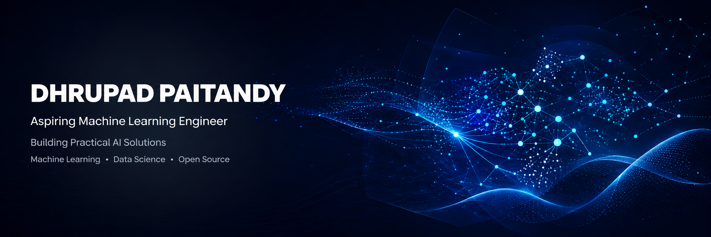

# Hi 👋, I'm Dhrupad Paitandy

### Building practical AI solutions with Machine Learning, Deep Learning and Full Stack Development.

---

# 🚀 About Me

- 🔭 Currently building **AI Resume Scanner**
- 🌱 Learning **XGBoost, Deep Learning Fundamentals & MLOps**
- 👯 Looking for **Machine Learning & Data Science Internship opportunities**
- 💬 Ask me about **Python, Machine Learning, Data Analysis & Open Source**
- 📫 **dhrupadpaitandy@gmail.com**
- 🏀 Outside coding, you'll probably find me playing basketball.

---

# 🎯 Current Focus

- 🤖 Machine Learning
- 📊 Data Science
- 🧠 Natural Language Processing
- 🚀 Open Source
- 💡 Building End-to-End AI Applications

---

# 💻 Tech Stack

### Languages

### Machine Learning

### Databases

### Tools

---

# ⭐ Featured Projects

- 🤖 **AI Resume Scanner** — https://ai-candidate-ranker-hackathon.streamlit.app/
- 📊 **Customer Segmentation** — https://github.com/Dhrupad-05/Projects/blob/main/Customer_Segementation.ipynb
- 🎬 **Movie Review Sentiment Analysis** — https://github.com/Dhrupad-05/Projects/blob/main/Sentiment_Analysis_of_Movie_Reviews_using_SVM%2C_Logistic_Regression%2C_and_Naive_Bayes.ipynb

---

# 🌍 Open Source

- GSSoC Contributor
- Interested in AI/ML and Data Science projects
- Always open to collaboration

---

# 🏆 Hackathons & Certifications

- AI Resume Scanner Hackathon
- Oracle AI Foundations
- Oracle Generative AI

---

# 📊 GitHub Analytics

 

---

# 📈 Activity Graph

---

# 🐍 Contribution Snake

---

### *Building today what I couldn't build yesterday.*

